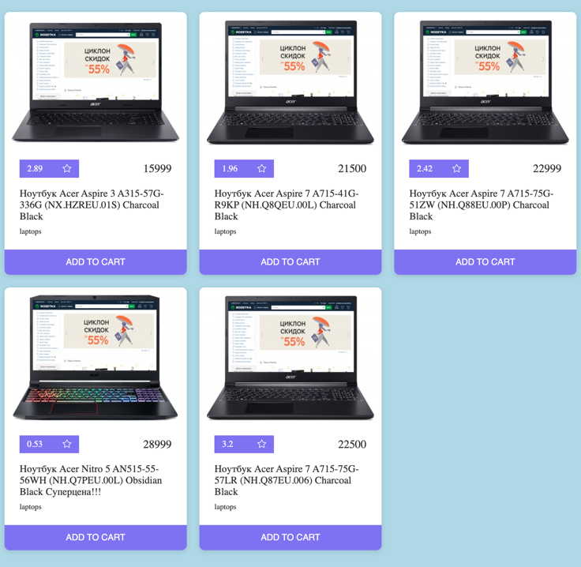

# JS | CardsList

Необхідно реалізувати CardsList компонент,
який буде відповідати за відображення списку карточок товарів.



На вхід компонент має приймати об'єкт аргументів виду:

```js
{
  data = [], 
  Component = {}
}
```

Де `Component` - це компонент для відображення одної карточки товару,
а `data` - масив данних товарів:

```json
[
  {
    "id": "76w0hz7015kkr9kjkav",
    "images": [
      "https://content2.rozetka.com.ua/goods/images/big_tile/163399632.jpg",
      "https://content.rozetka.com.ua/goods/images/big_tile/163399633.jpg"
    ],
    "title": "Ноутбук Acer Aspire 3 A315-57G-336G (NX.HZREU.01S) Charcoal Black",
    "rating": 2.89,
    "price": 15999,
    "category": "laptops",
    "brand": "acer"
  },
]
```

В комопненті треба передбачити метод `update`, який буде приймати, так само як
`constructor`, масив об'єктів і оновлювати відображення товарів. 
