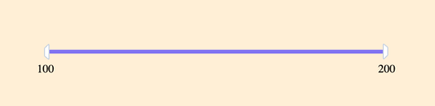

# JS | DoubleSlider component

Необхідно реалізувати DoubleSlider компонент,
який буде відповідати за фільтрацію списку товарів.



На вхід компонент має приймати об'єкт виду:

```js
{
  min = 100,
  max = 200,
  formatValue = value => value,
  selected = {
    from: min,
    to: max
  },
  precision = 0,
  filterName = ''
}
```

## Події компонента

DoubleSlider компонент повинен зробити `dispatch` події `range-selected`
при зміні вибраного діапазону.

