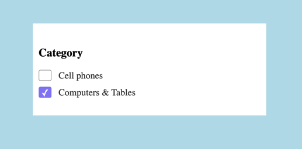

# JS | FiltersList component

Необхідно реалізувати FiltersList компонент який буде відповідати за відображення фільтрів
для списку товарів.



На вхід компонент має приймати об'єкт аргументів виду:

```js
{
 title = '',
 list = []
} 
```

Де `title` - це назва фільтру, а `list` це масив об'єктів наступного виду:

```js
[
  {
    value: 'category=cell_phones',
    title: 'Cell Phones',
  },
  {
    value: 'category=computer_tablets',
    title: 'Computers & Tablets',
  },
  {
    value: 'category=cell_phones_accessories',
    title: 'Cell Phone Accessories',
  }
]
```

В об'єкті `category` - це назва поля по якому буде відбуватись фільтр, a `=cell_phones` - значення
цього фільтру.

## Події компонента

При активації фільтру, компонент повинен зробити `dispatch` події `add-filter`,
а при деактивації фільтру - події `remove-filter` зі значенням `value`
