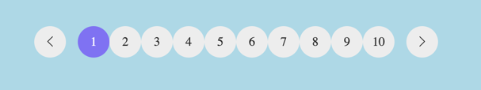

# Pagination component

* Зверстати Pagination component згідно мокапу:
  * Figma: https://www.figma.com/file/3hvww972yv3iEt7OVGnBFK/Online-Shop
  * Demo: http://online-store.bootcamp.place/
  
Note: Зверніть увагу що для іконок стрілок, до сторінки підключений [Bootstrap](https://getbootstrap.com/)

# Pagination компонент

Необхідно реалізувати Pagination компонент,
який буде відповідати за відображення та перехід по сторінкам товарів.



На вхід компонент має приймати об'єкт виду:

```
{
  totalPages = 10,
  page = 1
}
```

## Події компонента

Pagination компонент повинен зробити `dispatch` події `page-changed`
при зміні сторінки.

