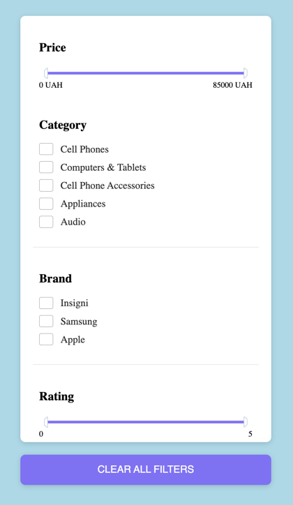

# SideBar

Необхідно реалізувати SideBar компонент,
який буде відповідати за відображення списку фільтрів.



На вхід компонент має приймати данні для ініціалізації фільтру по
категоріям та фільтру по брендам.

Для ініціалізації DoubleSlider фільтру по ціні, необхідно використати
наступні значення:
```
{
  min: 0,
  max: 85000,
  ...
}
```

Для ініціалізації DoubleSlider фільтру по рейтінгу, необхідно використати
наступні значення:
```
{
  min: 0,
  max: 5,
  precision: 2,
  ...
}
```

Компонент SideBar має імпортувати наступні компоненти:

* DoubleSlider
* FilterList

## Події компонента

При натисканні на кнопку "clear filters", компонент повинен зробити `dispatch` події `clear-filters`
